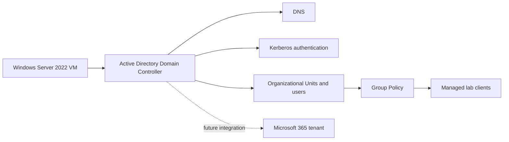

# Windows Server 2022 Active Directory Homelab

Portfolio project demonstrating how I built and validated a small Active Directory environment on Windows Server 2022 using Oracle VirtualBox. The project focuses on identity foundations, DNS, Kerberos, organizational units, Group Policy, and basic PowerShell administration.

## Why I built it

This project demonstrates four Cloud and Systems Engineer capabilities:

1. **Windows infrastructure foundations** — I installed and configured Windows Server 2022 in a virtualized lab environment.
2. **Identity and name resolution** — I installed AD DS, configured DNS, promoted the server to a domain controller, and validated Kerberos authentication.
3. **Access control through Group Policy** — I created organizational units, users, and policies that apply different controls to users and departments.
4. **Operational troubleshooting** — I used Server Manager, event logs, and PowerShell to validate configuration and investigate system behavior.

## Architecture

## What I implemented

### 1. Installed the server platform

I created the lab server in Oracle VirtualBox, installed Windows Server 2022, configured networking, and verified the initial Server Manager state.

### 2. Built the domain controller foundation

I installed the AD DS and administration tools, promoted the server to a domain controller, configured the `itsolutions.local` lab domain, and validated DNS and Kerberos behavior.

### 3. Created users, organizational units, and policies

I organized users into departmental OUs and applied Group Policy, including a test policy that restricts access to Control Panel and PC settings for the appropriate users.

### 4. Documented validation evidence

The screenshots capture the major milestones: server installation, AD tooling, IPv4 configuration, domain-controller state, Kerberos, user creation, GPO creation and assignment, and event-log review.

## Evidence

| Area | Evidence |
| --- | --- |
| Windows Server installation | [`install-ws2022.png`](screenshots/install-ws2022.png), [`installing-ws.png`](screenshots/installing-ws.png) |
| AD DS and networking | [`Installing-AD-Tools.png`](screenshots/Installing-AD-Tools.png), [`IPv4-configured.png`](screenshots/IPv4-configured.png) |
| Domain controller and Kerberos | [`server-manager.png`](screenshots/server-manager.png), [`Kerberos.png`](screenshots/Kerberos.png) |
| Users and Group Policy | [`Creating-new-user.png`](screenshots/Creating-new-user.png), [`creating-gpo.png`](screenshots/creating-gpo.png), [`assigning-gpo-user.png`](screenshots/assigning-gpo-user.png) |
| Troubleshooting and administration | [`events-log.png`](screenshots/events-log.png), [`AD-core.png`](screenshots/AD-core.png) |

## Skills demonstrated

- Windows Server 2022 administration
- Active Directory Domain Services
- DNS and Kerberos fundamentals
- Organizational unit and user design
- Group Policy creation and assignment
- VirtualBox-based lab infrastructure
- Event-log review and troubleshooting
- PowerShell administration fundamentals

## Relationship to my cloud portfolio

This project demonstrates the on-premises identity and infrastructure foundation that supports my later cloud work:

- [Microsoft 365 business environment](https://github.com/JuanMArroyo/m365-itsolutions-business) — identity, endpoint management, collaboration, security, and compliance.
- [Azure Kubernetes and ARC project](https://github.com/JuanMArroyo/github-arc-aks) — AKS infrastructure, GitHub Actions runners, Prometheus, Grafana, and alerting.

Together, these projects show a progression from Windows infrastructure and identity to Microsoft cloud administration and Azure/Kubernetes operations.

## Lessons learned

- DNS and time synchronization are foundational to reliable Active Directory authentication.
- Group Policy is most maintainable when OUs and security groups reflect clear administrative boundaries.
- Screenshots are useful evidence, but validation steps and troubleshooting notes make the work more credible.
- A homelab should clearly distinguish tested configuration from production recommendations.

## Security and scope

This is a learning homelab, not a production domain. The domain name, users, and policies are fictional examples. Any future screenshots should be reviewed for usernames, IP addresses, domain details, or other identifying information before publication.
