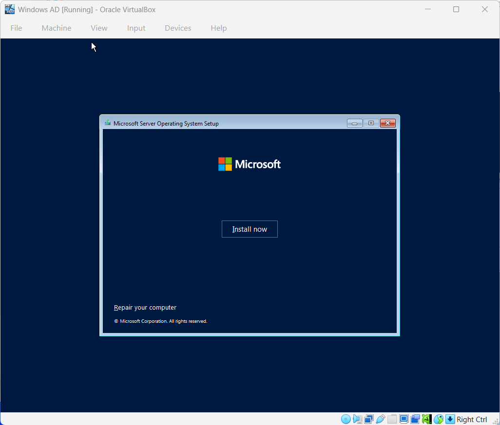
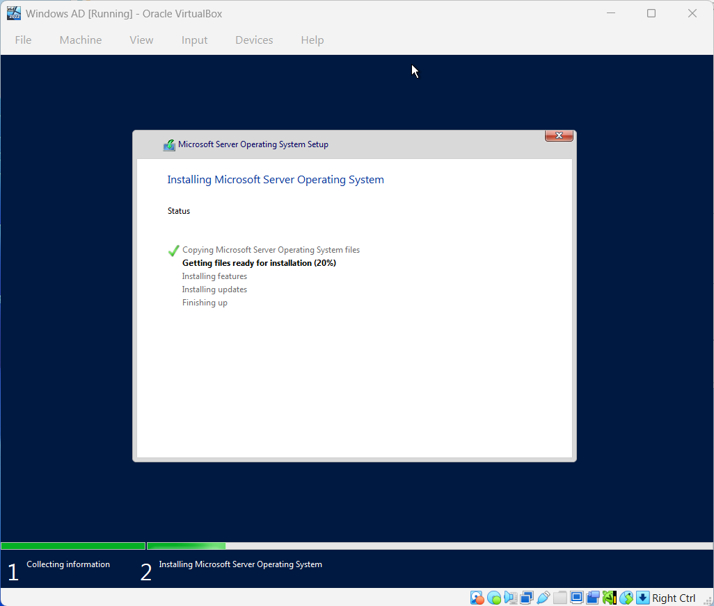
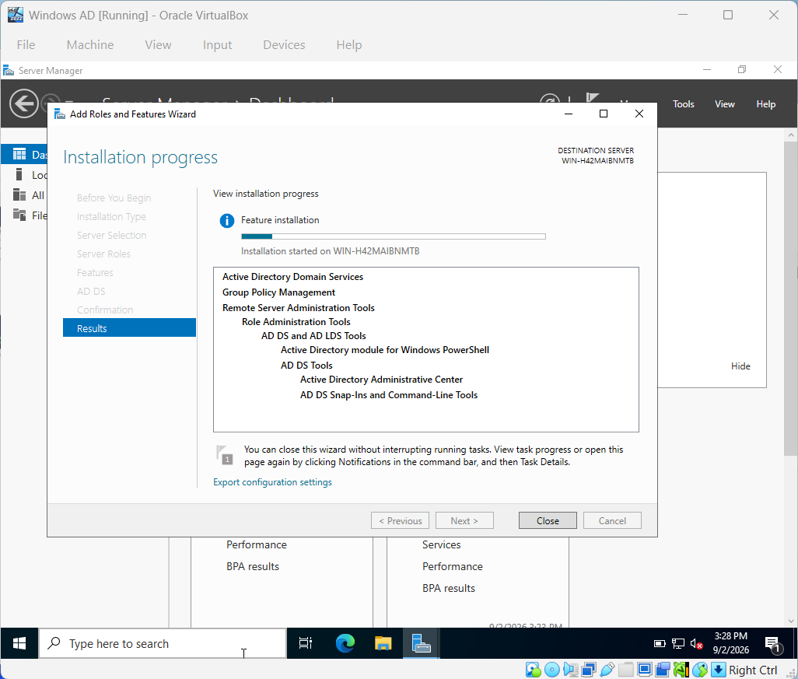
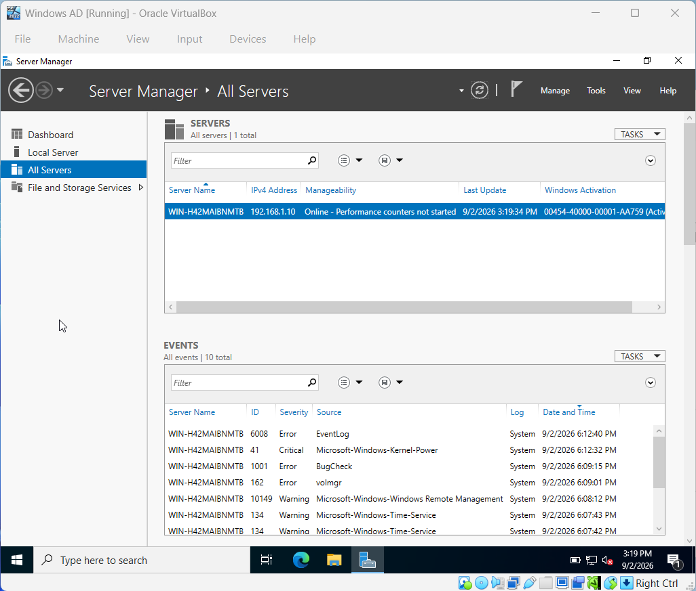
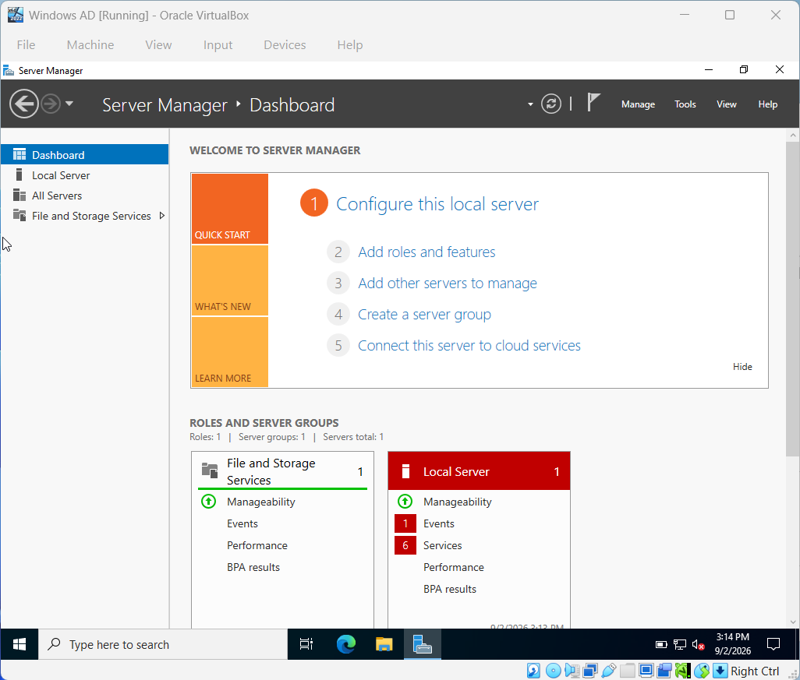
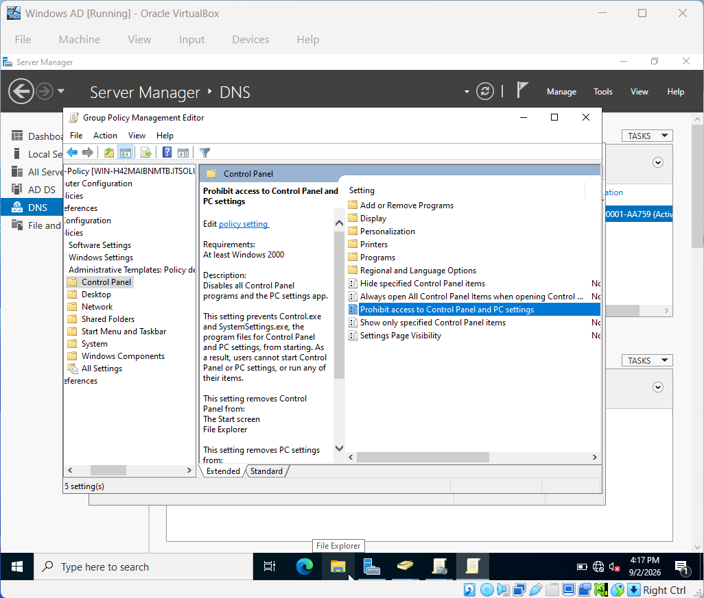
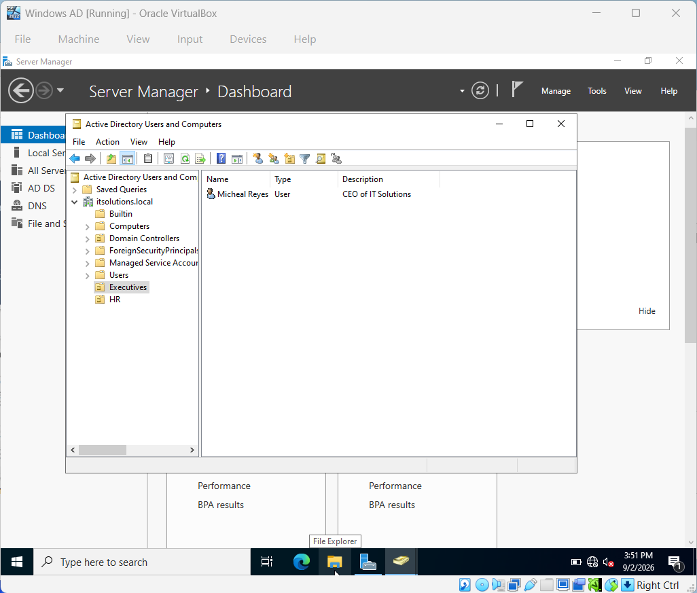
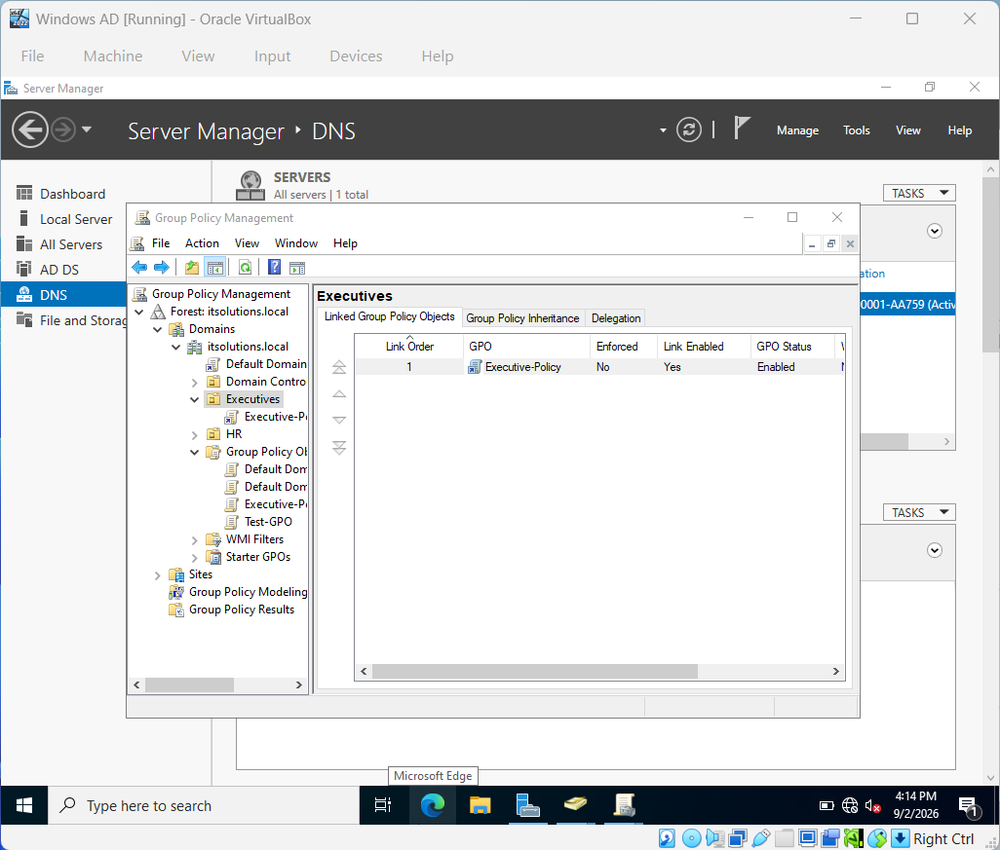

## 📸 Visual Walkthrough

Below are key stages of the Active Directory homelab build:

1. **Windows Server 2022 Installation**
   - Initial setup and configuration using Oracle VirtualBox.
   - Server Manager dashboard showing system details and remote management enabled.

2. **Active Directory Domain Services (AD DS) Installation**
   - Role installation wizard with AD DS, DNS, and Group Policy Management.
   - Successful prerequisite check and domain promotion to `itsolutions.local`.

3. **Domain Controller Configuration**
   - Server promoted to Domain Controller.
   - Verified DNS zone creation and Kerberos authentication setup.
  

4. **Organizational Units & Users**
   - Created OUs: Executives, HR, Domain Controllers, and Users.
   - Added user *Michael Reyes* (CEO of IT Solutions).
  

5. **Group Policy Management**
   - Configured GPOs: Default Domain Policy, Default Domain Controllers Policy, Test-GPO, and Executive-Policy.
   - Example: “Prohibit access to Control Panel and PC settings” applied to Executives OU.
  

6. **PowerShell Automation**
   - Demonstrated directory creation and scripting for homelab organization.
  
![AD core]!(./screenshots/AD-core.png)

---

Each screenshot documents a major milestone — from installation to policy enforcement — showing real-world system administration workflow and technical proficiency.
